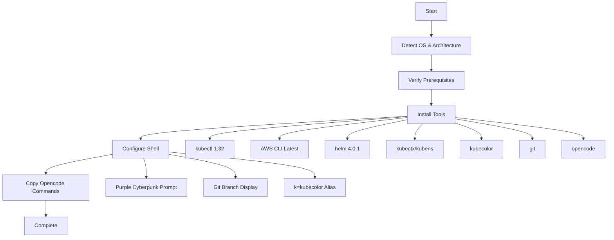
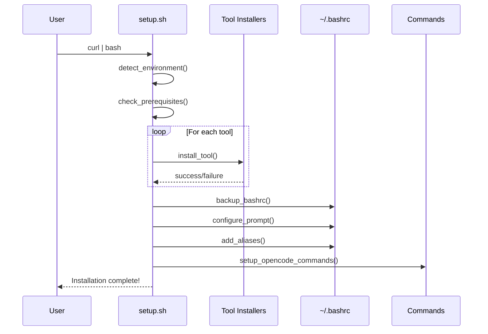

# Remote Shell Setup - System Design

## Architecture Overview

**What is the high-level system structure?**

The remote shell setup is a single bash script that orchestrates the installation and configuration of development tools. The architecture follows a simple, linear execution flow:



### Key Components and Responsibilities

1. **Environment Detection Module**: Identifies OS distribution, OS family (Debian/Ubuntu vs RHEL-based), architecture, and existing tools
2. **OS Package Manager Module**: Handles distribution-specific package installations using apt, yum, or dnf
3. **Tool Installation Functions**: Individual functions for each tool installation (binary downloads as primary, package managers as fallback)
4. **Configuration Manager**: Modifies ~/.bashrc with prompt and aliases
5. **Opencode Integration**: Copies custom commands to the appropriate directory

### Technology Stack

- **Language**: Bash (POSIX-compliant where possible)
- **Download Tool**: curl (with wget fallback)
- **Archive Handling**: tar, unzip
- **Configuration**: ~/.bashrc modifications

## Data Models

**What data do we need to manage?**

### Tool Configuration Structure

```bash
# Tool metadata and installation parameters
TOOLS[
  "kubectl"]={
    version: "1.32.0",
    url_pattern: "https://dl.k8s.io/release/v{version}/bin/linux/{arch}/kubectl",
    check_cmd: "kubectl version --client",
    install_method: "binary"
  },
  "aws-cli"={
    version: "latest",
    url: "https://awscli.amazonaws.com/awscli-exe-linux-{arch}.zip",
    check_cmd: "aws --version",
    install_method: "zip_bundle"
  },
  "helm"={
    version: "4.0.1",
    url_pattern: "https://get.helm.sh/helm-v{version}-linux-{arch}.tar.gz",
    check_cmd: "helm version",
    install_method: "tarball"
  },
  "kubectx"={
    version: "latest",
    repo: "https://github.com/ahmetb/kubectx",
    check_cmd: "kubectx --version",
    install_method: "binary_release"
  },
  "kubens"={
    version: "bundled",
    bundled_with: "kubectx",
    check_cmd: "kubens --version"
  },
  "kubecolor"={
    version: "latest",
    repo: "https://github.com/hidetatz/kubecolor",
    check_cmd: "kubecolor --version",
    install_method: "binary_release"
  }
]
```

### Configuration State

```bash
# Script-added sections in ~/.bashrc will be wrapped with markers:
# # === REMOTE-SHELL-SETUP START ===
# [configuration content]
# # === REMOTE-SHELL-SETUP END ===
```

## Component Breakdown

**What are the major building blocks?**

### 1. Main Script (`bin/setup.sh`)

**Responsibilities**:
- Entry point for the setup process
- Orchestrates the installation flow
- Provides user feedback and progress indicators
- Handles errors and cleanup

**Key Functions**:
- `main()`: Entry point
- `detect_environment()`: OS, OS family, and architecture detection
- `detect_os_family()`: Determine if Debian/Ubuntu or RHEL-based (CentOS, Oracle Linux, Amazon Linux)
- `check_prerequisites()`: Verify required utilities exist, install base dependencies via package manager if needed

### 2. Tool Installation Module

**Responsibilities**:
- Install each tool with proper error handling
- Skip already-installed tools
- Verify installations

**Functions** (one per tool):
- `install_kubectl()`: Download and install kubectl binary
- `install_aws_cli()`: Download and install AWS CLI
- `install_helm()`: Download and install helm
- `install_kubectx_kubens()`: Install kubectx and kubens
- `install_kubecolor()`: Install kubecolor
- `verify_git()`: Verify git is installed
- `install_opencode()`: Install opencode CLI

### 3. Shell Configuration Module

**Responsibilities**:
- Backup existing ~/.bashrc
- Add purple cyberpunk prompt configuration
- Add git branch display to prompt
- Add k=kubecolor alias

**Functions**:
- `backup_bashrc()`: Create backup of existing config
- `configure_prompt()`: Add color and git integration
- `add_aliases()`: Add useful aliases

### 4. OS Package Manager Module

**Responsibilities**:
- Detect OS distribution and family (Debian/Ubuntu vs RHEL-based)
- Install base dependencies using appropriate package manager
- Handle Oracle Linux as RHEL-based distribution
- Provide fallback installation methods

**Functions**:
- `detect_os_family()`: Identify OS family (debian, rhel, or unknown)
- `install_base_dependencies()`: Install curl, wget, tar, unzip if missing using apt/yum/dnf
- `has_package_manager()`: Check if apt, yum, or dnf is available

### 5. Opencode Integration Module

**Responsibilities**:
- Create opencode commands directory
- Copy custom command definitions
- Verify opencode installation

**Functions**:
- `setup_opencode_commands()`: Copy commands from repo

## Design Decisions

**Why did we choose this approach?**

### Decision 1: Single Script vs. Modular Structure

**Chosen**: Single monolithic script with well-organized functions

**Rationale**:
- Easier to distribute via `curl | bash`
- No dependency management complexity
- Self-contained and portable
- Users can inspect entire script before running

**Alternatives Considered**:
- Multiple separate scripts: Rejected due to complexity of distribution
- Ansible/Puppet: Rejected due to requiring additional dependencies

### Decision 2: Binary Downloads vs. Package Managers

**Chosen**: Download official binaries directly

**Rationale**:
- Consistent across all Linux distributions
- Always get the exact version requested
- No dependency on distribution-specific repositories
- Works on minimal systems without package managers

**Alternatives Considered**:
- apt/yum/dnf: Rejected due to version inconsistencies across distros
- Snap/Flatpak: Rejected due to not being universally available

### Decision 3: User-Level vs. System-Level Installation

**Chosen**: Prefer user-level installation (~/.local/bin)

**Rationale**:
- Doesn't require sudo
- Doesn't interfere with system packages
- Easier to manage and remove
- Safer for automated execution

**Fallback**: Use /usr/local/bin if user-level not possible

### Decision 4: Prompt Configuration Approach

**Chosen**: Append to ~/.bashrc with clear markers

**Rationale**:
- Non-destructive to existing configuration
- Easy to identify and remove if needed
- Works on all bash systems

**Implementation Details**:
```bash
# Color scheme: Purple cyberpunk
# - Purple (35m) for user and host
# - Cyan (36m) for current directory  
# - Green (32m) for git branch
# - Red (31m) for dirty git state
```

## Non-Functional Requirements

**How should the system perform?**

### Performance Targets

- **Total Execution Time**: < 5 minutes on a machine with 50+ Mbps connection
- **Individual Tool Installation**: < 60 seconds each
- **Prompt Configuration**: < 1 second
- **Memory Usage**: < 100MB peak

### Scalability Considerations

- Script should handle slow/intermittent connections gracefully
- Retry logic for failed downloads (3 attempts)
- Timeout on network operations (30 seconds)

### Security Requirements

1. **Checksum Verification**: Verify binary checksums where available
2. **HTTPS Only**: All downloads use HTTPS
3. **Minimal Permissions**: Don't run as root unless necessary
4. **Audit Trail**: Clear output of what's being installed

### Reliability/Availability Needs

- **Idempotent**: Running multiple times produces same result
- **Non-Breaking**: Won't break existing configurations
- **Rollback**: Backup created for ~/.bashrc modifications
- **Verification**: Each tool installation verified before continuing

### Error Handling Strategy

```bash
# Error handling pattern:
set -e  # Exit on error
set -u  # Exit on undefined variable
set -o pipefail  # Exit if any command in pipe fails

# Functions return non-zero on failure
# Main script catches failures and provides helpful error messages
```

## OS Detection and Distribution-Specific Handling

### OS Detection Logic

```bash
# Detection method: Check /etc/os-release
detect_os_family() {
    if [ -f /etc/os-release ]; then
        . /etc/os-release
        case "$ID" in
            ubuntu|debian|linuxmint|pop)
                echo "debian"
                ;;
            rhel|centos|fedora|rocky|almalinux|ol|oraclelinux|amzn)
                echo "rhel"
                ;;
            *)
                echo "unknown"
                ;;
        esac
    else
        echo "unknown"
    fi
}
```

### OS-Specific Package Installation

#### Debian/Ubuntu (apt)

**When to use**: Installing base dependencies (curl, wget, tar, unzip, git if missing)

```bash
install_apt_packages() {
    sudo apt-get update -qq
    sudo apt-get install -y -qq curl wget tar unzip git
}
```

**Supported distributions**:
- Ubuntu 18.04, 20.04, 22.04, 24.04+
- Debian 9, 10, 11, 12+
- Linux Mint
- Pop!_OS

#### RHEL-based (yum/dnf)

**When to use**: Installing base dependencies on RHEL, CentOS, Oracle Linux, Amazon Linux

```bash
install_yum_packages() {
    sudo yum install -y curl wget tar unzip git
}

install_dnf_packages() {
    sudo dnf install -y curl wget tar unzip git
}
```

**Supported distributions**:
- RHEL 7, 8, 9
- CentOS 7, Stream 8, 9
- Oracle Linux (OL) 7, 8, 9
- Amazon Linux 2, 2023
- Rocky Linux, AlmaLinux, Fedora

### Package Manager Detection

```bash
get_package_manager() {
    if command -v apt-get &>/dev/null; then
        echo "apt"
    elif command -v dnf &>/dev/null; then
        echo "dnf"
    elif command -v yum &>/dev/null; then
        echo "yum"
    else
        echo "none"
    fi
}
```

### Tool Installation Strategy by OS

**Primary approach** (all distributions): Download official binaries
- kubectl 1.32 binary
- AWS CLI zip bundle
- helm 4.0.1 tarball
- kubectx/kubens from GitHub releases
- kubecolor from GitHub releases
- opencode install script

**Secondary approach** (fallback): Use package managers only for:
- Base dependencies (curl, wget, tar, unzip)
- git (if not present)
- EPEL repository setup on RHEL-based systems for additional packages

### Oracle Linux Specific Handling

Oracle Linux should be detected and treated as RHEL-based:

```bash
# /etc/os-release for Oracle Linux 8:
# ID="ol"
# ID_LIKE="rhel fedora"
# NAME="Oracle Linux Server"

# Detection:
case "$ID" in
    ol|oraclelinux)
        OS_FAMILY="rhel"
        ;;
esac
```

### Error Handling for OS-Specific Operations

1. **No package manager found**: Continue with binary-only installations
2. **Package installation fails**: Log warning, continue with binary installs
3. **No sudo access**: Skip package manager installations, attempt user-level binary installs
4. **Unknown OS**: Default to binary-only installation method

## Installation Methods by Tool

### kubectl 1.32

**Method**: Download binary from official Kubernetes release

```bash
# URL format: https://dl.k8s.io/release/v1.32.0/bin/linux/{amd64,arm64}/kubectl
curl -LO "https://dl.k8s.io/release/v1.32.0/bin/linux/amd64/kubectl"
chmod +x kubectl
mv kubectl ~/.local/bin/
```

**Verification**: `kubectl version --client`

### AWS CLI

**Method**: Download and run official installer

```bash
# URL format: https://awscli.amazonaws.com/awscli-exe-linux-{x86_64,aarch64}.zip
curl -fsSL "https://awscli.amazonaws.com/awscli-exe-linux-x86_64.zip" -o "awscliv2.zip"
unzip -q awscliv2.zip
./aws/install --bin-dir ~/.local/bin --install-dir ~/.local/aws-cli --update
```

**Verification**: `aws --version`

### helm 4.0.1

**Method**: Download and extract tarball

```bash
# URL format: https://get.helm.sh/helm-v4.0.1-linux-{amd64,arm64}.tar.gz
curl -fsSL "https://get.helm.sh/helm-v4.0.1-linux-amd64.tar.gz" | tar -xz
mv linux-amd64/helm ~/.local/bin/
```

**Verification**: `helm version`

### kubectx & kubens

**Method**: Download binaries from GitHub releases

```bash
# URL: https://github.com/ahmetb/kubectx/releases/latest
curl -fsSL "https://github.com/ahmetb/kubectx/releases/latest/download/kubectx"
curl -fsSL "https://github.com/ahmetb/kubectx/releases/latest/download/kubens"
chmod +x kubectx kubens
mv kubectx kubens ~/.local/bin/
```

**Verification**: `kubectx --version`, `kubens --version`

### kubecolor

**Method**: Download binary from GitHub releases

```bash
# URL: https://github.com/hidetatz/kubecolor/releases/latest
# Detect architecture and download appropriate binary
curl -fsSL "https://github.com/hidetatz/kubecolor/releases/latest/download/kubecolor_{version}_Linux_{arch}.tar.gz" | tar -xz
mv kubecolor ~/.local/bin/
```

**Verification**: `kubecolor --version`

### git

**Method**: Verify existing installation

**Verification**: `git --version`

**Note**: If not installed, prompt user to install via system package manager

### opencode

**Method**: Download and install official binary

```bash
# Use official installation method
curl -fsSL https://opencode.ai/install.sh | bash
```

**Verification**: `opencode --version`

## Prompt Configuration Design

### Color Palette (Cyberpunk Purple Theme)

```bash
# ANSI color codes
PURPLE='\[\e[35m\]'      # Main prompt color
CYAN='\[\e[36m\]'        # Directory color
GREEN='\[\e[32m\]'       # Git clean state
YELLOW='\[\e[33m\]'      # Git modified state
RED='\[\e[31m\]'         # Error/git dirty state
RESET='\[\e[0m\]'        # Reset color
BOLD='\[\e[1m\]'         # Bold text
```

### Prompt Format

Simplified format:
```
[user@hostname:~/directory] (git-branch) $
```

With colors:
- User@hostname: Purple bold
- Directory: Cyan
- Git branch: Green (clean) or Yellow (dirty)
- Prompt symbol: Purple

### Git Integration

```bash
# Function to get git branch with color based on status
parse_git_branch() {
    local branch=$(git branch 2>/dev/null | sed -e '/^[^*]/d' -e 's/* \(.*\)/\1/')
    if [ -n "$branch" ]; then
        # Check if working tree is dirty
        if git diff --quiet 2>/dev/null && git diff --cached --quiet 2>/dev/null; then
            # Clean - green
            echo "(${GREEN}${branch}${RESET})"
        else
            # Dirty - yellow
            echo "(${YELLOW}${branch}${RESET})"
        fi
    fi
}

# Simplified PS1 format
PS1="${PURPLE}\u@\h${RESET}:${CYAN}\w${RESET} \$(parse_git_branch)$ "
```

## File Structure

```
remote-shell-setup/
├── setup.sh                  # Main installation script (in repo root)
├── config/
│   └── versions.conf         # Configuration file with tool versions
├── commands/
│   ├── code-review.md        # Opencode custom commands
│   ├── learn.md
│   ├── onboarding-plan.md
│   ├── pr-description.md
│   ├── explain-code.md
│   └── commit-message.md
├── docs/
│   └── ai/
│       ├── requirements/
│       │   └── feature-remote-shell-setup.md
│       ├── design/
│       │   └── feature-remote-shell-setup.md
│       ├── planning/
│       │   └── feature-remote-shell-setup.md
│       ├── implementation/
│       │   └── feature-remote-shell-setup.md
│       └── testing/
│           └── feature-remote-shell-setup.md
└── README.md
```

## Execution Flow


